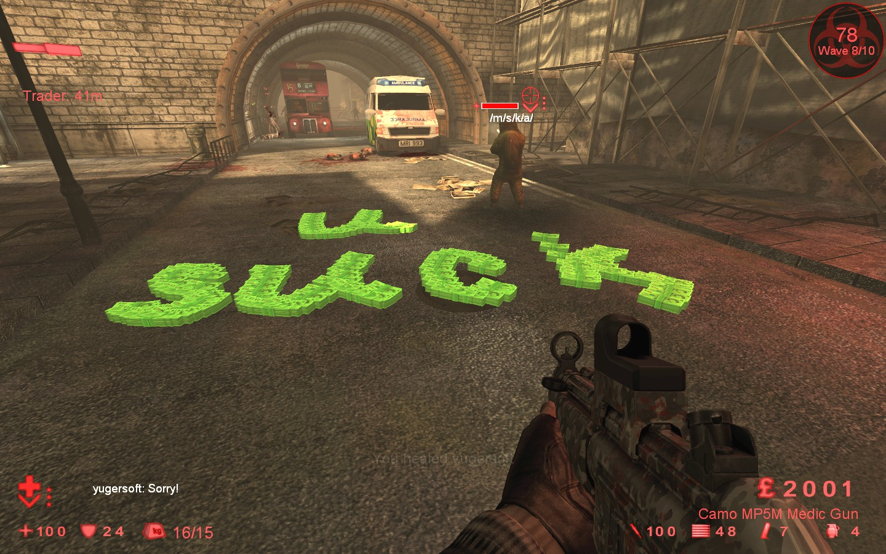

# General information

No restrictions for dosh tossing over a short period of time results in the following list of exploits:

1. Ability to bypass collision checks of almost all actors in the level, allowing players to reach the unreachable places.
2. Instantly kill *any* zeds.
3. Lag clients, crash servers.

## Detailed exploits description

### Exploits reasons

[KFMod/KFPawn.uc#2964](https://github.com/InsultingPros/KillingFloor/blob/6412f4322d353c05604db3851bdc4ca1d2f2ba32/KFMod/Classes/KFPawn.uc#L2964)

```clike
exec function TossCash( int Amount )
{
  ...

  if (Amount <= 0)
    Amount = 50;
  Controller.PlayerReplicationInfo.Score = int(Controller.PlayerReplicationInfo.Score); // To fix issue with throwing 0 pounds.
  if (Controller.PlayerReplicationInfo.Score <= 0 || Amount <= 0)
    return;
  Amount = Min(Amount,int(Controller.PlayerReplicationInfo.Score));

  ...
}
```

1. Not capping the minimum amount of dosh per toss. Which results in the ability to spawn as many `CashPickup` actors as your total dosh amount (by setting pickups value to £1.)
2. Since there's no timeout for `TossCash` execution, all the money can be tossed out very fast.

## #1: Collision bypass

Having tons of `CashPickup` actors concentrated in one spot is very calculation-heavy for the engine. Once the certain amount of actors is reached, the engine starts skipping calculation of collision between some of them. (It's what we came up with.)

Players can use this to bypass intended map-designers' blocks and reach the unreachable spots by going straight through static meshes, various blocking volumes, etc.

However, this doesn't work with:

- BSP Geometry
- Meshes with built-in blocking collision

[Video demonstration #1](https://www.youtube.com/watch?v=ie6ealc3-XA)

[Video demonstration #2](https://youtu.be/fbs7SBHWzlM)

[Video demonstration #3](https://youtu.be/mhQDbxvsH28)

## #2: Instant zed kill

Similarly to #1, players can use dosh to get inside zeds ignoring their collision. Once they are inside, they can duck to instantly kill the poor zed crushing it with their own collision. Be it a clot, a fleshpound, or even Patriarch.

[Video demonstration](https://youtu.be/FylKDUZnLDw)

## #3: Server crash

No matter how powerful the CPU of the server is, it can be overflown by an instant tossing of a huge amount of dosh.

Just sit, look at your feet and spam `TossCash` command as fast as you can.

£2500 will kill any server. £1500 is enough for the most. 500-700 can completely freeze the game until you stop throwing.

If you have 4k or more, you don't even need to look at your feet.

[Video demonstration](https://youtu.be/NGwXY79Ka0c)

## Proposed solution

Simply add a very small timeout after tossing.

After testing this with friends, we came up with `0.1f`. It prevents any dosh-related problems with a small exception (about this later) and it's not very restrictive so you still can please your inner Michelangelo:



Proposed fix:

[KFMod/KFPawn.uc](https://github.com/InsultingPros/KillingFloor/blob/main/KFMod/Classes/KFPawn.uc)

```clike
// add a new variable for checks
var float AllowedTossCashTime;

exec function TossCash(int Amount)
{
    ...

    // add delay check on top
    if (Level.TimeSeconds < AllowedTossCashTime)
      return;

    ...

    // refresh delay at the end
    AllowedTossCashTime = Level.TimeSeconds + 0.1f;
}
```

However, collision bypass won't be completely fixed. The bypass threshold for some of the *easiest* spots is 160-170 dosh pickups with mastered bypass skill. And the maximum amount of concurrent dosh pickups for 1 player with 0.1s timeout is roughly 85. Meaning 2-3 experienced players will still be able to bypass these spots. It'll be much harder, though, and some spots won't be bypassable even with 6 concurrently tossing players.

We still consider this a nice tradeoff between pleasant tossing experience and 0.01% of the playerbase who will be able to abuse this exploit. Keeping in mind that all other nasty dosh exploits are fixed.

If you want this completely fixed, you should restrict players to have no more than ~25 dosh pickups per ~8.5 seconds window. This is definitely not a very pleasant experience. You have 2 ways to achieve this:

- Simply raise the tossing timeout to `0.35f`.
- Additionally restrict tossing to 25 pickups per 8.5 seconds window.

```clike
var float AllowedTossCashTime, WindowEndTossCashTime;
var byte WindowTossCashCount;


exec function TossCash( int Amount )
{
    ...

    // check both delay and tossed amount
    if (Level.TimeSeconds < AllowedTossCashTime || (Level.TimeSeconds < WindowEndTossCashTime && WindowTossCashCount > 25))
      return;

    ...

    // update delay / amount
    AllowedTossCashTime = Level.TimeSeconds + 0.1f;
    if (WindowEndTossCashTime < Level.TimeSeconds)
    {
      WindowEndTossCashTime = Level.TimeSeconds + 8.5f;
      WindowTossCashCount = 0;
    }
    else
      ++WindowTossCashCount;
}
```

- Oh, and you can probably tweak something in the engine to prevent bypass exploit from happening.
